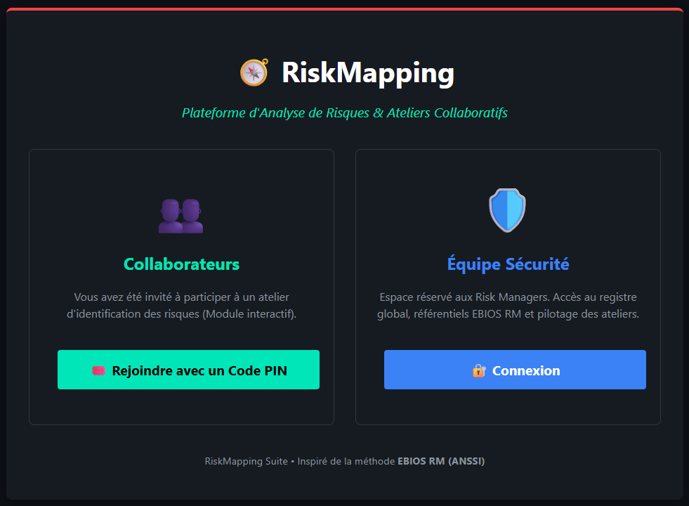
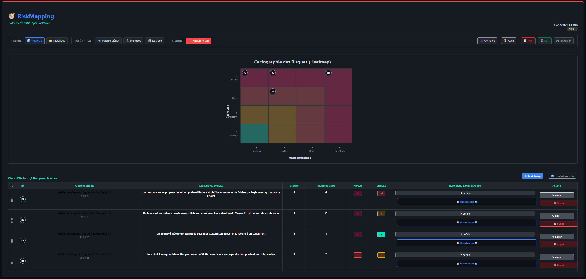
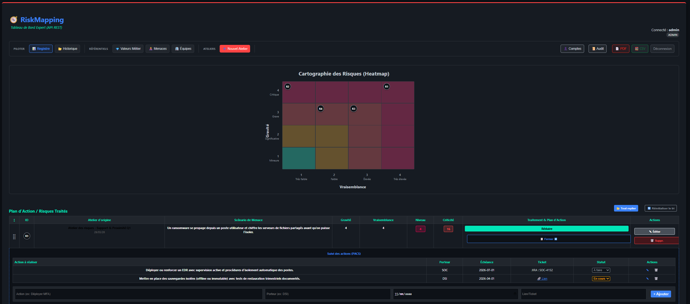
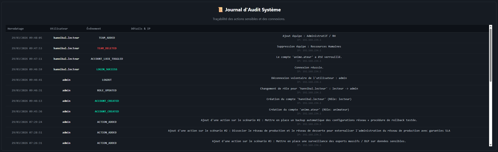

# 🧭 RiskMapping Suite

**RiskMapping Suite** est une plateforme open-source de pilotage des risques cyber structurée autour de la méthodologie **EBIOS RM** (ANSSI).

Conçue pour les RSSI, qualiticiens et équipes cybersécurité, elle couvre le cycle complet d'analyse : identification des sources de risque, qualification des scénarios stratégiques et opérationnels, pilotage du plan de traitement (PACS).


---

## 🖥️ Vue d'ensemble

<p align="center">
  
</p>

L'application supporte plusieurs entités et plusieurs analyses par entité. Chaque session est scopée à une analyse active, sélectionnée à la connexion.

---

## ✨ Fonctionnalités

### 📊 Registre des Risques (Pilotage)

Tableau de bord central de l'analyse. Chaque scénario de risque peut être qualifié, suivi et traité.

* **Registre dynamique** : gravité, vraisemblance, niveau de criticité calculé automatiquement selon la grille EBIOS RM.
* **Heatmap EBIOS RM** : cartographie visuelle en temps réel, zonage conforme à l'ANSSI.
* **Plan de Traitement (PACS)** : sous chaque risque, stratégie (Réduire / Transférer / Éviter / Accepter) déclinée en actions opérationnelles avec porteurs, échéances et liens tickets (Jira, ServiceNow, GLPI…).
* **Reporting** : export PDF (mode impression paysage, nettoyage visuel) et export CSV global.

<p align="center">
  
</p>

<p align="center">
  
</p>

---

### 📋 Atelier 1 — Cadrage & Valeurs Métier

* **Valeurs Métier** : identification et classification des actifs (Disponibilité, Intégrité, Confidentialité…).
* **Événements Redoutés** : rattachement à une valeur métier, catégorie (Financier, Opérationnel, Juridique, Image, Santé), impact et notes.
* **Biens Supports** : inventaire des systèmes et associations aux valeurs métier.

---

### 🔗 Atelier 2 — Sources de Risque & Objectifs Visés

* **Sources de Risque (SR)** : création et notation Motivation / Ressources / Activité (1 à 3).
* **Objectifs Visés (OV)** : associés à leur SR, qualifiés par pertinence (À évaluer / Retenu / Non retenu) via badge cyclique.
* **Vue groupée** : les OV sont affichés sous leur SR parente — corrélation SR → OV immédiatement lisible.
* **Pré-remplissage** : bouton « Pré-remplir EBIOS RM » injectant les 8 SR et 17 OV du référentiel officiel ANSSI.

---

### 🗺️ Atelier 3 — Parties Prenantes & Scénarios Stratégiques

Module d'évaluation de l'écosystème de l'organisation.

#### Parties Prenantes (PP)
Critères modifiables en ligne, recalcul immédiat :

| Critère | Valeurs |
|---------|---------|
| Dépendance | 1 Faible → 4 Critique |
| Pénétration | 1 Très limitée → 4 Totale |
| Maturité cyber | 1 Faible → 4 Avancée |
| Confiance | 1 Inconnue → 4 Forte |

Résultats calculés automatiquement : **Exposition** (Dépendance × Pénétration), **Fiabilité** (moyenne Maturité + Confiance), **Niveau de menace** (matrice Exposition × Fiabilité).

#### Matrice Exposition
Grille 4×4 Dépendance × Pénétration. Chaque PP est positionnée dans la cellule correspondante, colorée par niveau de menace (vert → jaune → orange → rouge).

#### Scénarios Stratégiques (SS)
Construction de scénarios `SR × PP → OV`. Chaque scénario est évalué (statut, gravité, vraisemblance) et peut être **envoyé au Registre des Risques** en un clic.

#### Bridge Atelier 3 → Registre
Les scénarios stratégiques retenus alimentent directement le Registre :
- Titre généré automatiquement : `SS-001 — Cybercriminel via Prestataire → Vol de données clients`
- Badge de provenance **🗺️ Scénario stratégique (A3)** visible dans le Registre
- Protection anti-doublon : un scénario ne peut être transféré qu'une seule fois
- Les entrées restent pleinement qualifiables depuis le Registre (stratégie, PACS…)

---

### 🛡️ Sécurité & Gouvernance

* **RBAC strict** : trois rôles hermétiques — `Admin`, `Animateur`, `Lecteur`.
* **Piste d'audit** : toutes les actions sensibles (créations, modifications, suppressions, élévations de privilèges) sont journalisées et horodatées.
* **Provisioning sécurisé** : les nouveaux comptes sont mis en quarantaine et nécessitent une validation manuelle par un administrateur.
* **Hachage Argon2id** (recommandation ANSSI) pour la protection des mots de passe.

<p align="center">
  
</p>

---

### 💾 Sauvegarde & Restauration

Export complet de la base en **JSON** ou **SQL** depuis l'interface (Paramètres → Sauvegardes). La restauration via import JSON réinjecte toutes les données sans écraser les comptes administrateurs existants.

---

## 🛠️ Déploiement

### Prérequis

* Docker & Docker Compose

### Démarrage rapide

```bash
git clone https://github.com/DeliriumVs/RiskMapping.git
cd RiskMapping
docker compose up -d
```

Accès : `http://localhost` (ou l'IP du serveur).

### Premier accès

Un compte administrateur de secours est provisionné au premier lancement :

| Champ | Valeur |
|-------|--------|
| Identifiant | `admin` |
| Mot de passe | `EBIOSRM` |

> **Action requise** : connectez-vous, créez un compte administrateur nominatif dans l'onglet « Comptes », puis verrouillez ou supprimez le compte par défaut.

---

## 🔄 Maintenance

### Mise à jour du schéma

Lors de mises à jour qui modifient la structure de la base (nouvelles tables, nouvelles colonnes), un rebuild du volume est nécessaire :

```bash
docker compose down -v
docker compose up -d
```

> ⚠️ Cette opération supprime toutes les données. Effectuez une sauvegarde JSON au préalable depuis l'interface.

### Mise à jour de l'application

```bash
git pull
docker compose up -d --build
```

---

## 📐 Architecture technique

| Composant | Technologie |
|-----------|-------------|
| Backend | PHP 8 (fragments SPA servis par fetch) |
| Base de données | MariaDB (MySQL) |
| Frontend | JavaScript vanilla + CSS custom |
| Conteneurisation | Docker Compose (nginx + php-fpm + MariaDB) |
| Auth | Sessions PHP + Argon2id |

L'application est une **SPA à fragments PHP** : une page hôte (`registre_risques.php`) charge dynamiquement les vues (ateliers, registre, administration) via `fetch()` sans rechargement de page.

---

## 🗺️ Feuille de route EBIOS RM

| Atelier | Contenu | Statut |
|---------|---------|--------|
| Atelier 1 | Cadrage, Valeurs Métier, Événements Redoutés, Biens Supports | ✅ Disponible |
| Atelier 2 | Sources de Risque, Objectifs Visés | ✅ Disponible |
| Atelier 3 | Parties Prenantes, Matrice Exposition, Scénarios Stratégiques | ✅ Disponible |
| Atelier 4 | Scénarios Opérationnels (Kill Chain, MITRE ATT&CK) | 🔲 Prévu |
| Atelier 5 | Traitement du risque (Registre + PACS) | ✅ Disponible |

---

## 📄 Licence

Open-source — voir le fichier `LICENSE`.
